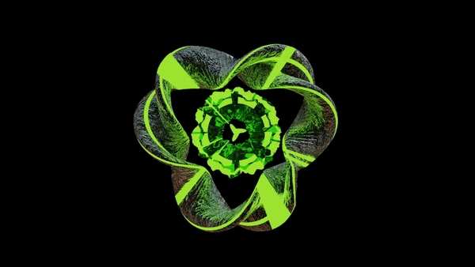

# Z4KKD Portfolio

Welcome to the official portfolio of **Zachary Duncan (Zakk)** – a Full-Stack Software Engineer with experience building production-grade web apps, APIs, and games.

This project showcases **my games, open-source projects, and technical skills**, all in one modern, responsive React website.


---

## 🚀 Features

* **Hero Section**: Personal introduction with animated GIF.
* **About/Services Section**: Details my skills, technologies, and experience.
* **Top Projects**:

  * Includes multiple links for projects (Live Site + Open Source).
  * Each project card has a title, description, background image, and action buttons.
* **Top Games**:

  * Interactive game cards linking to playable games on [itch.io](https://z4kkd.itch.io/).
  * Each card includes a title, description, background, and a "Play" button.
* **Responsive Navbar**: Collapsible menu for mobile devices.
* **Footer with Social Links**: Email, GitHub, LinkedIn, and Itch.io.

---

## 🖼️ Screenshots




---

## 🛠️ Technologies Used

* **Frontend:** React, JavaScript, HTML, CSS
* **Backend (Projects):** .NET Core, FastAPI, Django, Flask, Node.js/Express
* **Databases:** PostgreSQL, SQL Server, MongoDB Atlas, SQLite, Azure SQL
* **DevOps & Cloud:** Docker, Git, Azure, AWS, CI/CD Pipelines
* **Testing & Methodologies:** xUnit, Pytest, Jest, Agile/Scrum

---

## 📂 Project Structure

```
Z4KKD-PORTFOLIO
├── node_modules/
├── public/
│   ├── Z4KKD.png
├── src/
│   ├── assets/
│   │   ├── ChatBotAI.png
│   │   ├── DataVisualizationTool.png
│   │   ├── game3.png
│   │   ├── game4.png
│   │   ├── Myself.jpg
│   │   ├── Z4KKD.gif
│   │   ├── ZakksForms.png
│   ├── components/
│   │   ├── ExperienceAccordion.jsx
│   │   ├── Footer.jsx
│   │   ├── HeroInteractive.jsx
│   │   ├── Navbar.jsx
│   │   ├── ParticlesBackground.jsx
│   │   ├── ProjectsCarousel.jsx
│   │   ├── SkillsInteractive.jsx
│   ├── Pages/
│   │   ├── Home.jsx
│   ├── styles/
│   │   ├── experienceAccordion.css
│   │   ├── footer.css
│   │   ├── globals.css
│   │   ├── heroInteractive.css
│   │   ├── navbar.css
│   │   ├── particlesBackground.css
│   │   ├── projectsCarousel.css
│   │   ├── skillsInteractive.css
│   ├── App.jsx
│   └── main.jsx
├── .gitattributes
├── .gitignore
├── eslint.config.js
├── index.html
├── package-lock.json
├── package.json
├── README.md
├── SS.png
└── vite.config.js

```

---

## 🎮 Top Games

* **Terminal Hero** – [Play](https://z4kkd.itch.io/terminalhero)
* **Downhill Hurts** – [Play](https://z4kkd.itch.io/downhill-hurts)
* **Broke Booger** – [Play](https://z4kkd.itch.io/broke-booger)

---

## 💻 Top Projects

1. **AI-Powered Form Builder**
   Create smart forms quickly with AI-powered automation and validation.

   * [Live Site](https://zakksforms.netlify.app/)
   * [Open Source](https://github.com/Z4KKD/ZakksForms-Open-Source)

2. **Data Visualization Tool**
   Visualize datasets easily with dynamic charts and graphs.

   * [Open Source](https://github.com/Z4KKD/Data-visualization-tool)

3. **Chat Bot AI**
   Intelligent chatbot that can answer questions and automate tasks.

   * [Open Source](https://github.com/Z4KKD/Ai-ChatBot)

---

## 📥 Installation & Setup

1. Clone this repository:

```bash
git clone https://github.com/Z4KKD/portfolio.git
```

2. Navigate to the project directory:

```bash
cd portfolio
```

3. Install dependencies:

```bash
npm install
```

4. Start the development server:

```bash
npm start
```

The app should now be running on [http://localhost:3000](http://localhost:3000).

---

## 📬 Contact

* Email: [zduncan93@gmail.com](mailto:zduncan93@gmail.com)
* GitHub: [Z4KKD](https://github.com/Z4KKD)
* LinkedIn: [Z4KKD](https://www.linkedin.com/in/z4kkd/)
* Itch.io: [Z4KKD](https://z4kkd.itch.io/)

---

## 🐱 License

© Z4KKD 2025. All Rights Reserved.
